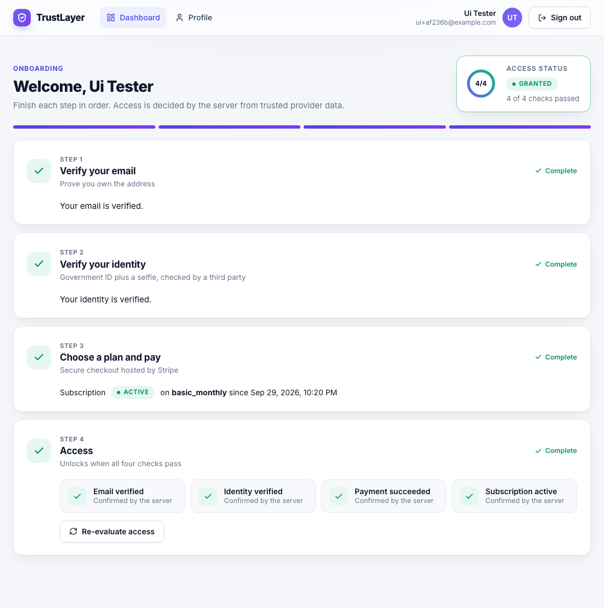
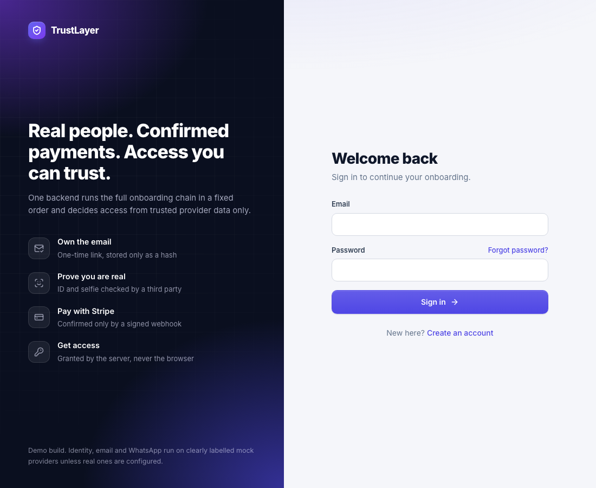
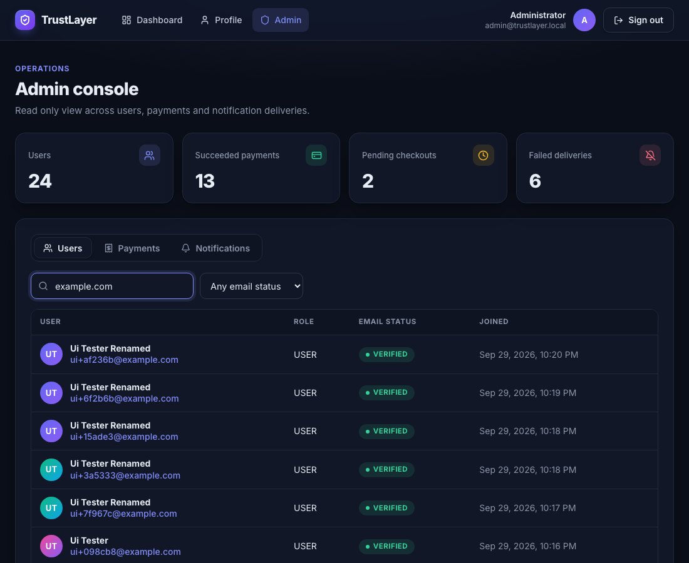
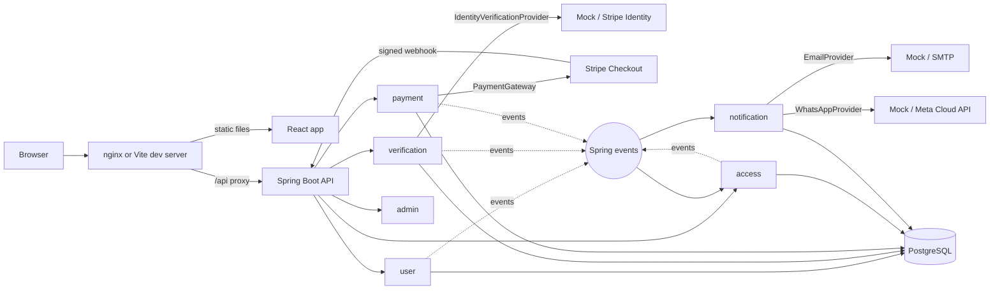
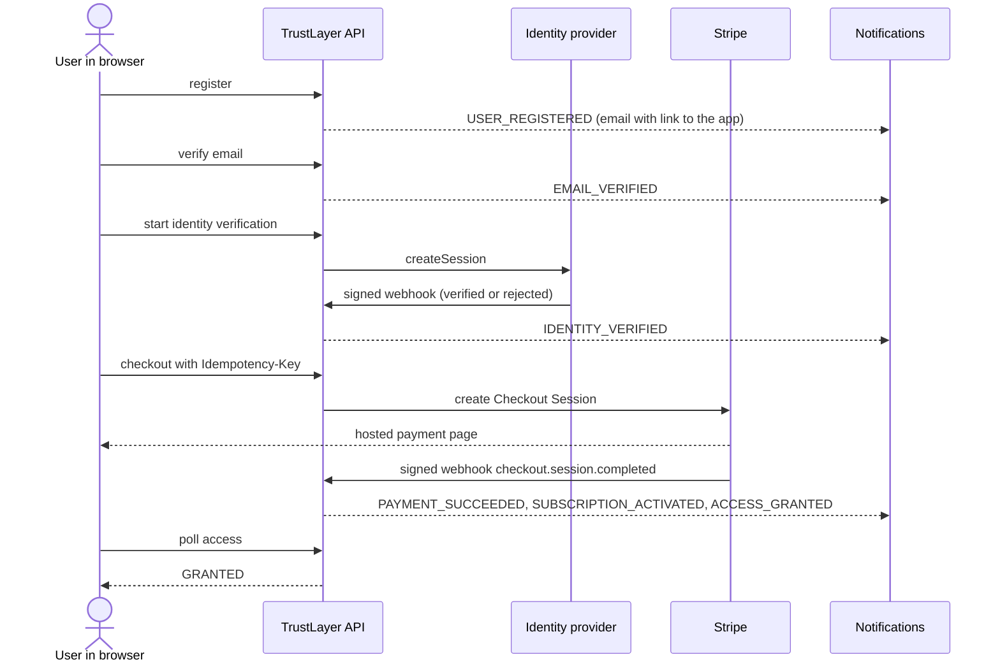
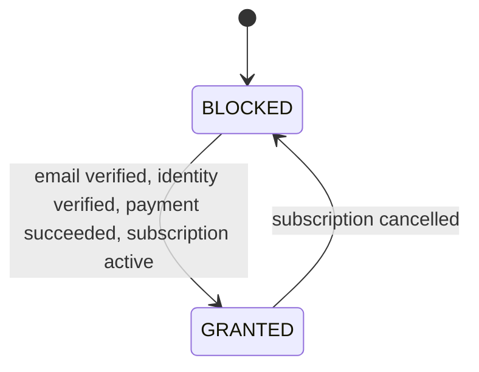

# TrustLayer

TrustLayer runs the whole trust chain for a paid product in a fixed order. A user registers, verifies their email, verifies their identity with ID and selfie, chooses a plan, pays, and gets access. Access is decided by the server from trusted provider data only. The browser is never trusted for payment or verification status.

This repository holds the complete system in one place.

| Folder | What it is |
|---|---|
| [backend/](backend) | Spring Boot 3 modular monolith on Java 21 with PostgreSQL, Flyway, JWT auth and the Stripe SDK |
| [frontend/](frontend) | React and TypeScript single page app that drives every backend flow |
| [docs/](docs) | Integration guide, demo script and screenshots |
| [scripts/](scripts) | Helper for sending locally signed Stripe webhooks |
| `docker-compose.yml` | PostgreSQL, backend and frontend in one command |



| Sign in | Admin console (dark mode) |
|---|---|
|  |  |

## Quick start

You need Docker.

```
cp .env.example .env
```

Set `DB_PASSWORD` and `JWT_SECRET` (at least 32 bytes) in `.env`. Everything else has a safe default. Then run everything.

```
docker compose up --build
```

- App at http://localhost:3000
- API docs at http://localhost:8080/swagger-ui
- Health at http://localhost:8080/actuator/health

Set `ADMIN_EMAIL` and `ADMIN_PASSWORD` in `.env` to get an admin account. The mock identity provider needs an admin to approve identities. Set `MOCK_NOTIFICATION_LOG_BODY=true` to see the verification link in the backend log during a local demo. Checkout needs `STRIPE_API_KEY` set to a Stripe test key.

Follow [docs/DEMO.md](docs/DEMO.md) for a five minute walkthrough through the UI.

### Development mode

```
docker compose up -d postgres
cd backend
mvn package -DskipTests
```

Load `.env` into your shell (for example `set -a` then `source ../.env`), then run `java -jar target/trustlayer.jar`. In another terminal:

```
cd frontend
npm install
npm run dev
```

The dev server at http://localhost:3000 proxies `/api` to the backend on port 8080, so the browser only ever talks to one origin.

## Real versus mock integrations

| Integration | Default | Real option |
|---|---|---|
| Identity and selfie | Mock (no selfie check) | Stripe Identity, test mode |
| Payments | Stripe test mode (needs a test key) | same |
| Email | Mock (logged, not sent) | SMTP |
| WhatsApp | Mock (logged, not sent) | Meta Cloud API |

A mock is never presented as a real integration. The mock identity provider performs no document or selfie check. It says so in every API response, in the startup log, in the UI and in this table.

## How the pieces fit



The browser and the API share one origin through the proxy, so there is no CORS configuration. See [docs/INTEGRATION.md](docs/INTEGRATION.md) for how the frontend authenticates, handles errors, pays and reacts to webhooks.

### The onboarding flow



### Access states



## Screens

| Screen | Route | Backend calls |
|---|---|---|
| Register, sign in, forgot and reset password | `/register`, `/login`, `/forgot-password`, `/reset-password` | users, auth |
| Verify email (target of the emailed link) | `/verify-email?token=` | auth |
| Dashboard with the four steps and live access state | `/dashboard` | access, verifications, plans, payments, subscriptions |
| Payment return pages | `/payment/success`, `/payment/cancel` | subscriptions, access |
| Profile | `/profile` | users |
| Admin lists with filters and paging | `/admin` | admin users, payments, notifications |
| Admin user overview with mock identity decision | `/admin/users/:id` | admin overview, verifications |

## UI design

The frontend is built with plain CSS on a small set of design tokens (color, radius, shadow) defined on `:root`, with a full dark palette that follows the system setting. Type is Inter with JetBrains Mono for IDs. Icons come from Lucide. There is no UI kit.

- Auth screens use a split layout. The left panel explains the trust chain and the right panel holds the form. On phones only the form shows.
- The dashboard is a four step timeline. Each step is marked complete, up next or locked, with a progress bar and an access ring showing how many of the four checks passed.
- Status is always a colored pill with the raw server value, so what you see matches the API.
- The admin console has summary counts, segmented tabs, a debounced search and paged tables with avatars.
- Every API error shows its code, message and correlation ID.
- Motion is limited to short fades and hover lifts and is switched off for users who prefer reduced motion.

## Backend modules

A modular monolith. One Spring Boot application, one PostgreSQL database, one package per module. Each module has `domain`, `application`, `infrastructure` and `web` packages. A small `api` package holds the public contract a module offers to others. No module reads another module's tables. Cross-module links are plain UUID columns.

| Module | Responsibility |
|---|---|
| user | Registration, login, JWT, rotating refresh tokens, email verification, password reset, profile |
| verification | Identity sessions behind `IdentityVerificationProvider`, signed and idempotent webhook, attempt cap |
| payment | Plans, idempotent Checkout creation, Stripe webhook, transactions, attempts, subscriptions |
| access | Decides GRANTED or BLOCKED from facts it learns through events |
| notification | Turns events into email and WhatsApp deliveries with bounded retries |
| admin | Read only, paginated, filterable views composed from the public `api` packages of the other modules |

## Endpoints

Everything is under `/api/v1`.

| Area | Endpoints |
|---|---|
| Auth and users | `POST /users`, `POST /auth/login`, `POST /auth/refresh`, `POST /auth/logout`, `POST /auth/verify-email`, `POST /auth/password-reset/request`, `POST /auth/password-reset/confirm`, `GET /users/me`, `PUT /users/me` |
| Verification | `POST /verifications`, `GET /verifications/{id}`, `POST /verifications/webhook`, `POST /verifications/{id}/mock-decision` (mock provider, ADMIN) |
| Payments | `GET /plans`, `POST /payments/checkout`, `GET /payments/{id}`, `GET /subscriptions/me`, `POST /payments/webhook` |
| Access | `GET /access/me`, `POST /access/evaluate` |
| Admin | `GET /admin/users`, `GET /admin/users/{id}/overview`, `GET /admin/payments`, `GET /admin/notifications` |

Errors always use one body with `timestamp`, `status`, `code`, `message` and `correlationId`. Validation errors add a `details` list. Stack traces never reach clients. The UI shows the code, message and correlation ID for every failed call.

## Design decisions worth explaining

**Authentication.** Passwords use BCrypt with strength 12. Access tokens are 15 minute JWTs. Refresh tokens are random, stored as SHA-256 hashes, valid for 7 days and rotated on every use. Presenting an already used refresh token revokes the whole token family. Logout revokes the family. Email verification and password reset tokens are hashed, single use and expire. Login is rate limited per IP and an account locks for 15 minutes after 5 failed attempts. Unknown emails take the same code path and return the same error as wrong passwords.

**Webhooks.** Both webhook endpoints verify the provider signature against the raw request body. Each event is inserted into a webhook events table with a unique provider and event ID using `insert ... on conflict do nothing`. A duplicate is acknowledged and skipped. The insert and the state change share one transaction, so a failure rolls back both and the provider retries.

**Checkout idempotency.** The `Idempotency-Key` header is required. The service first claims the key in its own transaction, then calls Stripe with a Stripe idempotency key derived from it, then stores the transaction and links it to the claim. The same key and request returns the original result. The same key with a different plan returns 422. A failed Stripe call releases the claim so the client can retry. The frontend keeps one key per plan for the life of the page, so a double click never creates two sessions.

**Events.** Modules talk through in-process Spring events with the versioned shape `eventId`, `eventType`, `eventVersion`, `occurredAt`, `aggregateId`, `payload`. Listeners run after the publishing transaction commits, so a rolled back transaction never announces anything. State changing listeners (access) run in their own transaction. Notification listeners run on a bounded async executor with the request's correlation ID copied over.

**Notifications.** Each event creates one delivery per channel. A delivery is tried up to 3 times with exponential backoff and ends as SENT or FAILED. A failing provider never touches the payment flow. Message text lives only in memory. The database keeps status, attempts and the exception class name, never message bodies or tokens.

**Data protection.** The app never receives or stores ID images or selfies. It stores only the provider session reference, status and result. Secrets come from environment variables only. Logs never contain passwords, tokens, payment secrets or identity data. The one exception is an opt in flag, `MOCK_NOTIFICATION_LOG_BODY`, which makes the mock providers print message bodies so you can copy the verification link during a local demo. It is off by default.

## Configuration

Every setting is an environment variable. `.env.example` lists all of them with placeholders only.

| Variable | Purpose |
|---|---|
| `DB_URL`, `DB_USER`, `DB_PASSWORD` | PostgreSQL connection |
| `JWT_SECRET` | HMAC key for access tokens, at least 32 bytes |
| `APP_BASE_URL` | Where the frontend lives. Emailed links point here. Default `http://localhost:3000` |
| `FRONTEND_PORT`, `PORT` | Host ports for the frontend container and the backend |
| `ADMIN_EMAIL`, `ADMIN_PASSWORD` | Creates the first ADMIN user at startup when both are set |
| `IDENTITY_PROVIDER` | `mock` (default) or `stripe` |
| `IDENTITY_MOCK_WEBHOOK_SECRET` | HMAC secret for the signed mock identity webhook, empty disables that webhook |
| `STRIPE_API_KEY`, `STRIPE_WEBHOOK_SECRET` | Stripe test mode key and payment webhook secret |
| `STRIPE_IDENTITY_WEBHOOK_SECRET` | Webhook secret for the Stripe Identity endpoint |
| `STRIPE_PRICE_BASIC_MONTHLY`, `STRIPE_PRICE_PRO_MONTHLY` | Optional Stripe price IDs. Without them checkout uses inline price data from the plans table |
| `PAYMENT_SUCCESS_URL`, `PAYMENT_CANCEL_URL` | Where Stripe returns the browser. Defaults match the frontend routes |
| `EMAIL_PROVIDER` | `mock` (default) or `smtp`, with `SMTP_HOST`, `SMTP_PORT`, `SMTP_USER`, `SMTP_PASSWORD`, `MAIL_FROM` |
| `WHATSAPP_PROVIDER` | `mock` (default) or `meta`, with `META_PHONE_NUMBER_ID`, `META_ACCESS_TOKEN` |
| `MOCK_NOTIFICATION_LOG_BODY`, `MOCK_NOTIFICATION_FAIL` | Demo and failure simulation switches for the mock providers |
| `RATE_LIMIT_PER_MINUTE` | Per IP limit on auth endpoints |

The mock identity webhook takes a JSON body with `eventId`, `providerRef`, `status` (`VERIFIED` or `REJECTED`) and optional `reason`, plus an `X-Mock-Signature` header holding the hex HMAC SHA-256 of the raw body using `IDENTITY_MOCK_WEBHOOK_SECRET`.

## Verification status

The backend was exercised end to end over HTTP against PostgreSQL 16 in Docker. The frontend was driven in a real Chromium browser against the running backend, in light mode, dark mode and at phone width. Payment creation was tested against a local stub that imitates the Stripe API, and Stripe webhooks were sent with locally computed signatures in Stripe's format. [PROGRESS.md](PROGRESS.md) lists exactly what is verified and what is not.

## Known limitations

- Events are in process. A crash between commit and handler loses the event. An outbox is the first upgrade.
- Verification and password reset tokens travel in the payload of in-process events. Before moving events to Kafka, replace them with a token-less design.
- Rate limiting is in memory and per instance. Redis would make it shared.
- A crash between claiming an idempotency key and storing the transaction leaves a claim that needs manual cleanup.
- Stripe Identity treats `requires_input` with an error as a rejected attempt. A later success on the same Stripe session is ignored and the user starts a new attempt.
- WhatsApp sends plain text. Business initiated messages outside the 24 hour window need approved templates on the Meta side.
- The frontend keeps tokens in session storage, which script injection could read. See the integration guide for the tradeoff.
- The dashboard polls every 3 seconds instead of using server push.
- There are no automated tests in the repository yet. Testcontainers for the backend and Playwright for the frontend are the planned next step.

## Future improvements

1. Automated tests with Testcontainers and Playwright
2. Transactional outbox and Kafka
3. Retry topics and DLQ
4. OpenTelemetry, Jaeger, Prometheus
5. Splitting modules into services
6. Refunds, invoices and multiple currencies
