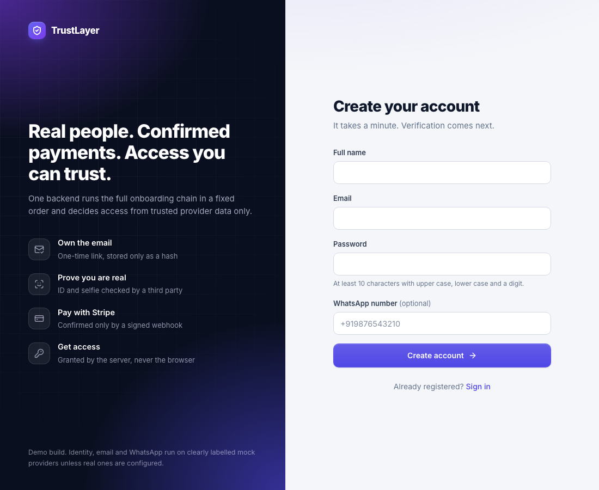
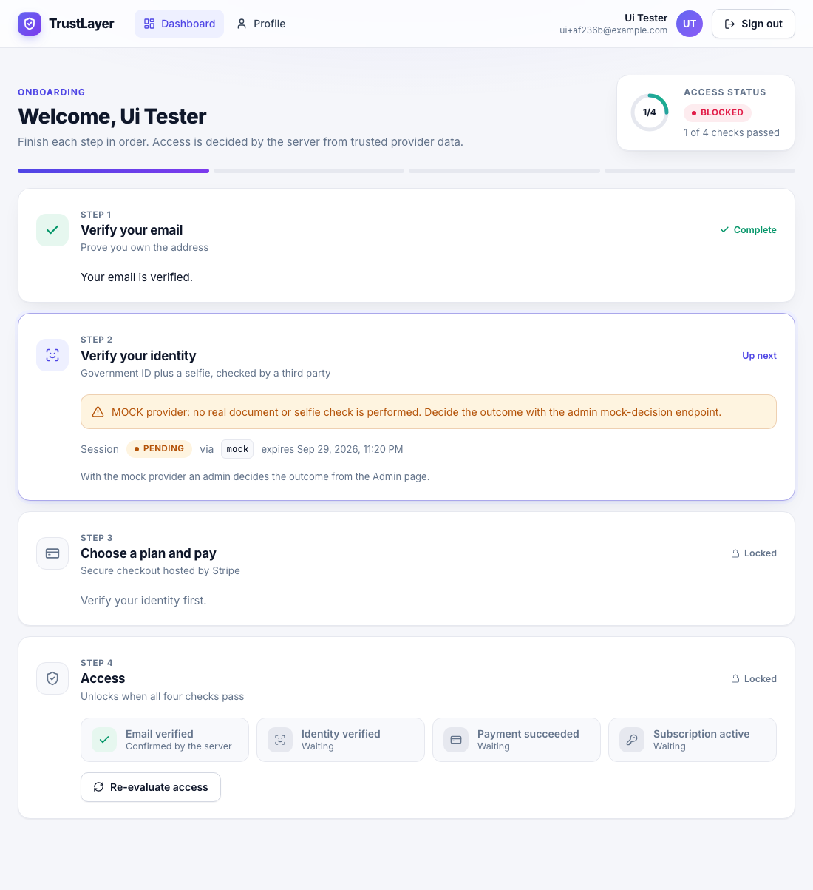
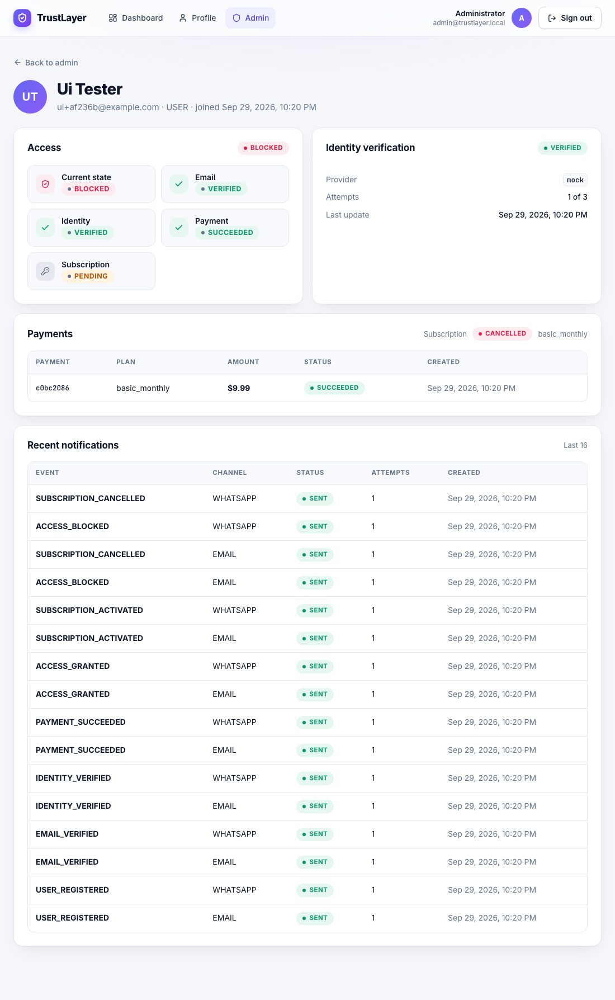
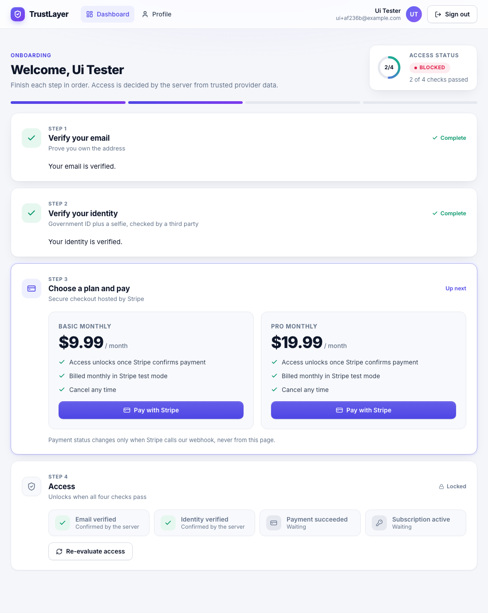
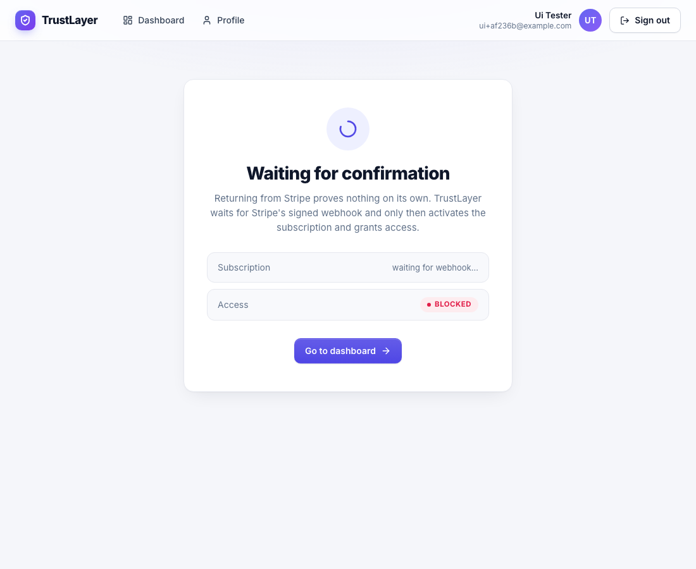
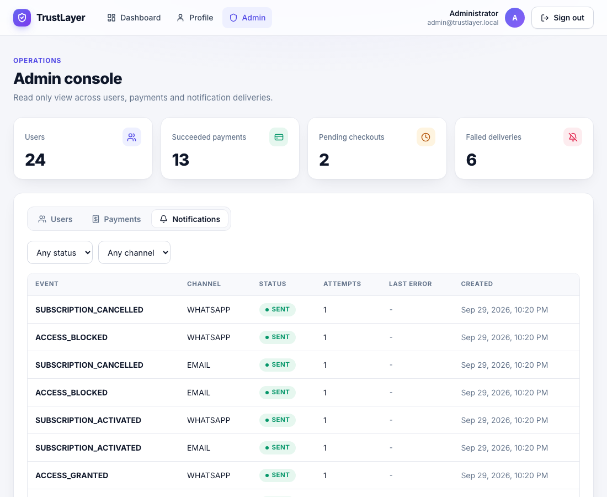

# Demo script

A five minute walkthrough of the full chain through the UI. It uses the mock identity provider and Stripe test mode.

## Setup

```
cp .env.example .env
```

Edit `.env` and set these values.

- `DB_PASSWORD` and `JWT_SECRET` to random values
- `ADMIN_EMAIL` and `ADMIN_PASSWORD` (upper case, lower case and a digit)
- `IDENTITY_MOCK_WEBHOOK_SECRET` to any random string
- `MOCK_NOTIFICATION_LOG_BODY=true` so the mock email prints the verification link in the backend log
- `STRIPE_API_KEY` to your Stripe test secret key
- `STRIPE_WEBHOOK_SECRET` to the secret printed by `stripe listen`

Start everything.

```
docker compose up --build
```

Forward Stripe events in a second terminal.

```
stripe listen --forward-to localhost:8080/api/v1/payments/webhook
```

Open http://localhost:3000 in one browser window and a private window for the admin.

## 1. Register

Open Create account and fill the form. A weak password is rejected with the backend's `WEAK_PASSWORD` message. Use a strong one to continue.



## 2. Verify email

Find the line with `verify-email?token=` in the backend log.

```
docker compose logs backend | grep verify-email
```

Open that link. The app verifies the token and shows Email verified.

## 3. Sign in and see the dashboard

The dashboard shows four steps and an Access badge that starts as BLOCKED.

## 4. Verify identity with the mock provider

Click Start verification. The dashboard shows a warning that this is a mock and no real selfie check happens.



In the private window sign in as the admin, open Admin, search for the user and open them. Click Mark verified.



The user's dashboard notices within 3 seconds and unlocks the plans.



## 5. Pay

Click Pay with Stripe on a plan. Pay with the test card 4242 4242 4242 4242. Double clicking the button never creates two Stripe sessions because the same `Idempotency-Key` is reused.

## 6. Watch the webhook do the work

Stripe returns you to a page that says Waiting for confirmation. The redirect proves nothing. When Stripe's webhook arrives, the page flips to Payment confirmed.



Open the dashboard. Access is GRANTED.


## 7. Replay the webhook

Resend a captured event with `stripe events resend <evt_id>`. State does not change a second time. Without the Stripe CLI, `scripts/send-stripe-webhook.sh` sends a locally signed event using your webhook secret.

## 8. Cancel and see access blocked

Cancel the subscription in the Stripe dashboard or with `stripe subscriptions cancel <sub_id>`. The `customer.subscription.deleted` webhook moves access to BLOCKED and the dashboard follows.

## 9. Admin view

The admin user overview shows identity status, payments, subscription, access state and every notification delivery. The notifications tab lists deliveries across all users with status and channel filters.



## Using curl instead of the UI

Every screen is a thin layer over the REST API, so each step also works with curl.

```
curl -s -X POST localhost:8080/api/v1/users -H 'Content-Type: application/json' \
  -d '{"email":"demo@example.com","password":"Str0ng-Password-1","fullName":"Demo User","phoneNumber":"+919876543210"}'
```

Swagger UI at http://localhost:8080/swagger-ui lists all endpoints and accepts a bearer token.
