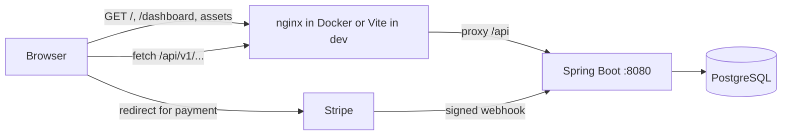
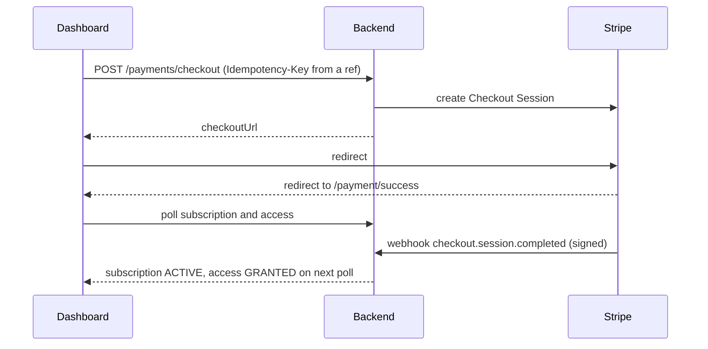

# Frontend and backend integration

This guide explains how the React app in `frontend/` talks to the Spring Boot API in `backend/`, and why each choice was made.

## Topology



The frontend and the API are served from one origin. nginx does this in Docker (`frontend/nginx.conf`) and the Vite dev server does it locally (`frontend/vite.config.ts`). Because the browser never makes a cross origin call, the backend needs no CORS configuration. Deep links such as `/verify-email?token=...` fall back to `index.html` so the single page app can route them.

Stripe webhooks skip the browser. Stripe calls the backend directly, so the backend port must be reachable by Stripe (through the Stripe CLI in local development).

## How the two halves know about each other

| Setting | Lives in | Why it matters |
|---|---|---|
| `APP_BASE_URL` | backend | Emailed links point at the frontend routes `/verify-email` and `/reset-password` |
| `PAYMENT_SUCCESS_URL`, `PAYMENT_CANCEL_URL` | backend | Stripe sends the browser to `/payment/success` and `/payment/cancel` |
| `/api` proxy target | frontend | `BACKEND_URL` for Vite, `proxy_pass http://backend:8080` for nginx |

The defaults line up on `http://localhost:3000`, so nothing needs changing for a local run.

## Authentication in the browser

`frontend/src/api.ts` is the only place that talks to the API.

1. Login stores the access token (15 minutes) and the refresh token (7 days) in `sessionStorage`.
2. Every request adds `Authorization: Bearer <access token>`.
3. On a 401 the client makes one refresh call and retries the original request once. Concurrent 401s share the same refresh call, because the backend rotates refresh tokens and a second parallel refresh would look like token reuse and revoke the family.
4. If the refresh fails, local tokens are cleared, the session is dropped and route guards send the user to the sign in page.
5. Sign out clears local tokens first and then tells the backend to revoke the token family. The user is signed out in the browser even if that call fails.

Route guards in `components/Guards.tsx` are a convenience only. The backend enforces every role rule, so a user who edits the client still gets a 403 from `/api/v1/admin/**`.

Tradeoff: `sessionStorage` is readable by injected script. An httpOnly cookie for the refresh token would remove that risk. It needs CORS or a shared origin plus CSRF protection, so it is listed as a future improvement rather than half done.

## Error handling

The backend always answers with `timestamp`, `status`, `code`, `message`, `correlationId` and, for validation, a `details` list. The client turns that into an `ApiError`, and `components/ErrorNotice.tsx` shows the code, message, field details and correlation ID. A support person can paste that correlation ID and find the exact request in the backend's JSON logs.

## Screen to endpoint map

| Screen | Calls |
|---|---|
| Register | `POST /users` |
| Verify email | `POST /auth/verify-email` with the token from the URL |
| Sign in | `POST /auth/login`, then `GET /users/me` |
| Forgot and reset password | `POST /auth/password-reset/request`, `POST /auth/password-reset/confirm` |
| Dashboard | `GET /access/me` and `GET /subscriptions/me` every 3 seconds, `GET /plans`, `POST /verifications`, `GET /verifications/{id}`, `POST /payments/checkout`, `POST /access/evaluate` |
| Payment success | `GET /subscriptions/me`, `GET /access/me` every 2 seconds |
| Profile | `GET /users/me`, `PUT /users/me` |
| Admin lists | `GET /admin/users`, `GET /admin/payments`, `GET /admin/notifications` with `page`, `size` and filters |
| Admin user overview | `GET /admin/users/{id}/overview`, `POST /verifications/{id}/mock-decision` |

## The payment integration



Two rules matter here.

- The success page does not decide anything. It says it is waiting for confirmation and changes only when the polled backend state changes. Opening `/payment/success` by hand proves nothing.
- The dashboard creates one `Idempotency-Key` per plan and reuses it for the life of the page. A double click, a retry after a network error or a second tab session all return the same Checkout Session.

## Identity verification in the UI

With the mock provider the dashboard shows a clear warning that no real check happens. The user starts a session, then an admin opens that user in the Admin page and chooses Mark verified or Mark rejected. The dashboard notices the change through polling and unlocks the payment step. With `IDENTITY_PROVIDER=stripe` the dashboard shows an Open identity check button that goes to Stripe's hosted flow, and the result arrives through Stripe's webhook.

## Frontend structure

```
frontend/src
  api.ts            typed fetch wrapper, token handling, refresh, endpoint functions
  auth.tsx          AuthProvider and useAuth
  hooks.ts          useAction (submit state and errors), usePolling, formatters
  components/       Layout, route guards, ErrorNotice, Badge, Pager
  pages/            one file per screen
  styles.css        design tokens with automatic dark mode
```

Dependencies are React, React Router, Lucide icons and Vite. There is no state library and no UI kit.

## What was tested

A Playwright script drove Chromium against the running backend through the Vite proxy. It covered 29 checks.

- registration with a rejected weak password, then success
- verification through the emailed link
- route guard redirect and wrong password error
- dashboard steps, mock identity label, admin decision in a second browser session
- checkout redirect to the Stripe URL and a success page that waits for the webhook
- a locally signed webhook flipping the UI to confirmed and access to GRANTED
- a cancel webhook flipping access to BLOCKED
- admin notifications table and user overview
- profile update, password reset, sign out and non admin blocked from the admin page
- no unexpected console errors
- no horizontal overflow on the register page at phone width

The Stripe API was a local stub and the webhooks were signed locally, so the real Stripe hosted page was not part of this test. A shorter browser smoke test ran against the production build served by nginx in Docker: sign in, dashboard, admin tabs, reload on a deep route, web font loaded and no page errors. Checkout was not run there because the Docker backend has no Stripe stub.
