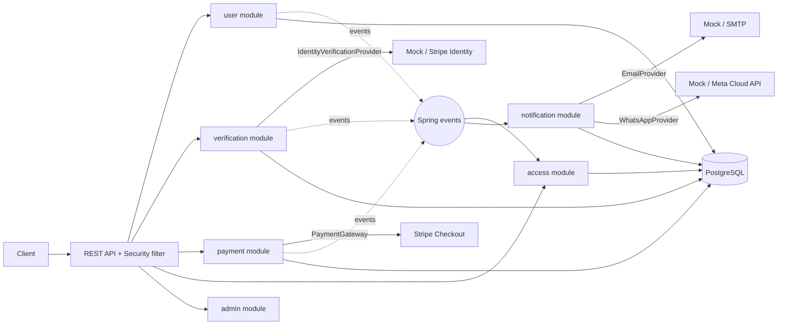

# TrustLayer PRD

Version 1.0 (MVP)
Stack: Java 21, Spring Boot 3, PostgreSQL, Docker
Architecture: modular monolith

## 1. Problem

Businesses that sell a paid product or service need to be sure of three things before they give a user access. The user owns their email, the user is a real person, and the user has paid. Today teams wire these checks together by hand across an auth system, an identity vendor, a payment provider and a messaging tool. The result is fragile flows, duplicate charges, missed webhooks and users who pay but never get access.

## 2. Solution

TrustLayer is one backend that runs the whole chain in a fixed order.

Register, verify email, verify identity (ID plus selfie), choose a plan, pay, receive the payment webhook, activate the subscription, grant access, notify the user by email and WhatsApp.

Access is decided by the server from trusted provider data only. The client is never trusted for payment or verification status.

## 3. Goals

1. A complete, working onboarding-to-access flow that runs locally.
2. Correct handling of the hard parts: webhook signature checks, duplicate webhooks, duplicate requests, provider failures.
3. Third-party integrations behind interfaces so any provider can be swapped.
4. Clean module boundaries so a module can later become a service without a rewrite.
5. Easy to demo in five minutes.

## 4. Non-goals for MVP

- Kafka, Redis, outbox, DLQ
- OpenTelemetry, Jaeger, Prometheus, Grafana
- Automated tests (added in a later phase)
- Separate microservices
- A polished frontend
- Multi-currency, taxes, invoices, refunds, coupons
- Storing ID documents or selfie images

## 5. Users and roles

| Role | Description |
|---|---|
| USER | End customer who registers, verifies, pays and gets access |
| ADMIN | Operator with read-only visibility into all users and statuses |

## 6. Architecture

One Spring Boot application, one PostgreSQL database, split into packages by module. Each module has its own tables, its own service layer, and talks to other modules only through public interfaces or domain events. No module reads another module's tables.



Package layout inside each module: `domain`, `application`, `infrastructure`, `web`. Controllers stay thin, business rules live in domain and application code, providers live in infrastructure.

## 7. Functional requirements

### 7.1 Authentication (user module)

| ID | Requirement |
|---|---|
| A1 | Register with email, password, full name. Email is unique and case-insensitive |
| A2 | Passwords hashed with Argon2 or BCrypt, minimum strength enforced |
| A3 | On registration create a one-time email verification token, store only its hash, expire it in 24 hours |
| A4 | Verify email with the token, mark user verified, emit `EMAIL_VERIFIED` |
| A5 | Login returns a short-lived JWT access token (15 min) and a refresh token (7 days) |
| A6 | Refresh tokens are stored hashed, rotated on every use, and reuse of an old token revokes the whole token family |
| A7 | Logout revokes the refresh token |
| A8 | Password reset via emailed one-time token |
| A9 | Roles USER and ADMIN enforced with method and route security |
| A10 | Rate limit login and verification endpoints, lock out after repeated failures |
| A11 | Get and update own profile |

Endpoints

```
POST /api/v1/users
POST /api/v1/auth/login
POST /api/v1/auth/refresh
POST /api/v1/auth/logout
POST /api/v1/auth/verify-email
POST /api/v1/auth/password-reset/request
POST /api/v1/auth/password-reset/confirm
GET  /api/v1/users/me
PUT  /api/v1/users/me
```

### 7.2 Identity verification with selfie (verification module)

Verification is done by a third party. The app never receives or stores ID images or selfies. It stores only the provider session reference, status and result.

| ID | Requirement |
|---|---|
| V1 | Only users with a verified email can start verification |
| V2 | Provider interface with `createSession(user)` and `getResult(providerRef)` |
| V3 | `StripeIdentityProvider` does ID document plus selfie match in Stripe's hosted flow (test mode) |
| V4 | `MockIdentityProvider` is the default so the app runs with no credentials, it does not perform a real selfie check and is labelled as a mock |
| V5 | Provider chosen by an environment variable |
| V6 | States: PENDING, IN_PROGRESS, VERIFIED, REJECTED, EXPIRED |
| V7 | Webhook endpoint updates state, verifies the provider signature, and is idempotent |
| V8 | Sessions expire after a configured time, expired sessions cannot be completed |
| V9 | Emit `IDENTITY_VERIFIED` or `IDENTITY_REJECTED` |
| V10 | Rejected users can start a new session, capped at 3 attempts |

Endpoints

```
POST /api/v1/verifications
GET  /api/v1/verifications/{id}
POST /api/v1/verifications/webhook
POST /api/v1/verifications/{id}/mock-decision   (mock provider only, ADMIN)
```

### 7.3 Payments (payment module)

| ID | Requirement |
|---|---|
| P1 | Fixed plans stored in the database (for example Basic monthly, Pro monthly) mapped to Stripe price IDs |
| P2 | Only identity-verified users can create a checkout |
| P3 | Create a Stripe Checkout Session server-side and return its URL |
| P4 | `Idempotency-Key` header required on checkout, the same key and user returns the original result |
| P5 | Payment status comes only from the Stripe webhook, never from the client redirect |
| P6 | Verify the Stripe webhook signature against the raw request body |
| P7 | Store each webhook in `webhook_events` with a unique provider event ID, duplicates are acknowledged and skipped |
| P8 | Handle `checkout.session.completed`, `checkout.session.expired`, `invoice.payment_failed`, `customer.subscription.deleted` |
| P9 | On success persist the transaction, create the subscription, emit `PAYMENT_SUCCEEDED` and `SUBSCRIPTION_ACTIVATED` |
| P10 | On failure emit `PAYMENT_FAILED`, on cancel emit `SUBSCRIPTION_CANCELLED` |
| P11 | Payment attempts recorded per checkout |

Endpoints

```
GET  /api/v1/plans
POST /api/v1/payments/checkout
GET  /api/v1/payments/{id}
GET  /api/v1/subscriptions/me
POST /api/v1/payments/webhook
```

### 7.4 Access (access module)

| ID | Requirement |
|---|---|
| X1 | Access rule: email verified AND identity verified AND payment succeeded AND subscription active |
| X2 | Access state is updated by reacting to events, the module has no dependency on Stripe |
| X3 | Cancelled or expired subscription moves the user to BLOCKED |
| X4 | Emit `ACCESS_GRANTED` and `ACCESS_BLOCKED` on state change only |
| X5 | Evaluate endpoint recomputes state from stored facts, useful for recovery |

Endpoints

```
GET  /api/v1/access/me
POST /api/v1/access/evaluate
```

### 7.5 Notifications (notification module)

| ID | Requirement |
|---|---|
| N1 | Listen to domain events and create a notification record per channel |
| N2 | Events covered: `USER_REGISTERED`, `EMAIL_VERIFIED`, `IDENTITY_VERIFIED`, `IDENTITY_REJECTED`, `PAYMENT_SUCCEEDED`, `PAYMENT_FAILED`, `SUBSCRIPTION_ACTIVATED`, `ACCESS_GRANTED` |
| N3 | `EmailProvider` interface with Mock and SMTP implementations |
| N4 | `WhatsAppProvider` interface with Mock and Meta Cloud API implementations |
| N5 | Sending runs asynchronously so it never blocks the main request |
| N6 | Delivery status stored: PENDING, SENT, FAILED, RETRYING |
| N7 | Retry up to 3 times with backoff, then mark FAILED, no infinite loops |
| N8 | Message bodies never contain tokens beyond the link the user needs, and logs never contain them |

### 7.6 Admin (admin module)

Read-only endpoints for ADMIN showing users, verification status, payments, subscriptions, access state and notification deliveries, with pagination and filters.

```
GET /api/v1/admin/users
GET /api/v1/admin/users/{id}/overview
GET /api/v1/admin/payments
GET /api/v1/admin/notifications
```

## 8. Domain events

Events are internal Spring application events with an explicit, versioned shape so they can move to Kafka later without redesign.

```json
{
  "eventId": "uuid",
  "eventType": "PAYMENT_SUCCEEDED",
  "eventVersion": 1,
  "occurredAt": "2026-01-01T10:00:00Z",
  "aggregateId": "uuid",
  "payload": {}
}
```

| Event | Producer | Consumers |
|---|---|---|
| USER_REGISTERED | user | notification |
| EMAIL_VERIFIED | user | access, notification |
| IDENTITY_VERIFIED | verification | access, notification |
| IDENTITY_REJECTED | verification | notification |
| PAYMENT_SUCCEEDED | payment | access, notification |
| PAYMENT_FAILED | payment | notification |
| SUBSCRIPTION_ACTIVATED | payment | access, notification |
| SUBSCRIPTION_CANCELLED | payment | access, notification |
| ACCESS_GRANTED | access | notification |
| ACCESS_BLOCKED | access | notification |

Events that change state in another module are published after the database transaction commits, so a rolled-back transaction never announces anything.

## 9. Data model

All tables use UUID primary keys, `created_at`, `updated_at`, and a `version` column where concurrent updates matter. Flyway manages migrations.

| Module | Tables |
|---|---|
| user | users, user_profiles, email_verification_tokens, refresh_tokens, password_reset_tokens |
| verification | verification_sessions, verification_results, webhook_events (provider scoped) |
| payment | plans, payment_transactions, payment_attempts, subscriptions, webhook_events, idempotency_keys |
| access | access_grants |
| notification | notification_events, notification_deliveries |

Key constraints

- `users.email` unique on lowercased value
- `webhook_events (provider, provider_event_id)` unique
- `idempotency_keys (user_id, key)` unique
- One active subscription per user, enforced by a partial unique index
- Foreign keys inside a module only, cross-module links are plain UUID columns
- Indexes on every foreign key and on status columns used in admin filters

## 10. Non-functional requirements

Security

- No secrets in the repository, all config through environment variables, `.env.example` has placeholders only
- Never log passwords, tokens, payment secrets or identity data
- Verified webhook signatures for Stripe and the identity provider
- Consistent error body with code, message, timestamp and correlation ID, no stack traces to clients
- Input validation on every request

Reliability

- Webhook handlers are idempotent
- Checkout creation is idempotent
- External calls have timeouts, provider failures map to clear errors
- Notification retries are bounded

Operability

- Structured JSON logs with a correlation ID per request
- Health endpoint through Actuator
- Swagger UI at `/swagger-ui`
- `docker compose up` starts PostgreSQL and the app

## 11. Real versus mock integrations

| Integration | Default | Real option |
|---|---|---|
| Identity and selfie | Mock (no selfie check) | Stripe Identity, test mode |
| Payments | Stripe test mode (needs a test key) | same |
| Email | Mock (logged, not sent) | SMTP |
| WhatsApp | Mock (logged, not sent) | Meta Cloud API |

The README will state this table as is. A mock is never presented as a real integration.

## 12. Tech stack

Java 21, Spring Boot 3.x, Spring Web, Spring Security, Spring Data JPA, Spring Validation, Spring Actuator, PostgreSQL, Flyway, JJWT or Nimbus for JWT, Argon2 through Spring Security crypto, Stripe Java SDK, springdoc-openapi, Bucket4j for rate limiting, Maven, Docker and Docker Compose.

## 13. Phases

| Phase | Scope | Done when |
|---|---|---|
| 1 | Project skeleton, config, error handling, Flyway, Docker Compose | App boots against PostgreSQL |
| 2 | User module and full authentication | Register, verify, login, refresh, logout work via curl |
| 3 | Verification module with mock provider, then Stripe Identity | Session created, webhook moves state |
| 4 | Payment module with Stripe Checkout and webhooks | Test payment activates a subscription, duplicate webhook is skipped |
| 5 | Events and access module | Access flips to GRANTED after payment |
| 6 | Notification module with mock providers, then real ones | Deliveries recorded with retries |
| 7 | Admin endpoints | Overview endpoint shows the full user state |
| 8 | README, diagrams, demo script | A new engineer can run it from the README |

Each phase ends with a build and a manual run before the next one starts.

## 14. Acceptance criteria for the MVP

1. A new user can go from registration to granted access using only the API.
2. Sending the same Stripe webhook three times changes state once.
3. Sending the same checkout request twice with one `Idempotency-Key` creates one Stripe session.
4. A user without verified identity cannot create a checkout.
5. Cancelling a subscription blocks access.
6. A failing email or WhatsApp provider never breaks the payment flow.
7. The app starts with mocks and no private credentials.
8. No secret appears in the repository.

## 15. Risks and open questions

| Item | Note |
|---|---|
| Stripe Identity availability | May need enabling in the Stripe dashboard and may be region limited, mock covers the gap |
| Webhook testing locally | Needs the Stripe CLI to forward events |
| In-process events | Lost on a crash between commit and handler, accepted for MVP and the reason an outbox is the first upgrade |
| Real WhatsApp | Meta business account setup is slow, mock is the default |

## 16. Future improvements

1. Automated tests with Testcontainers
2. Transactional outbox and Kafka
3. Retry topics and DLQ
4. OpenTelemetry, Jaeger, Prometheus
5. Splitting modules into services
6. Refunds, invoices and multiple currencies
